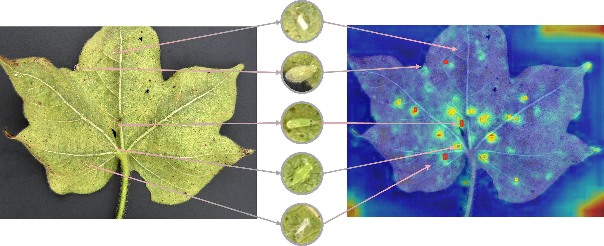
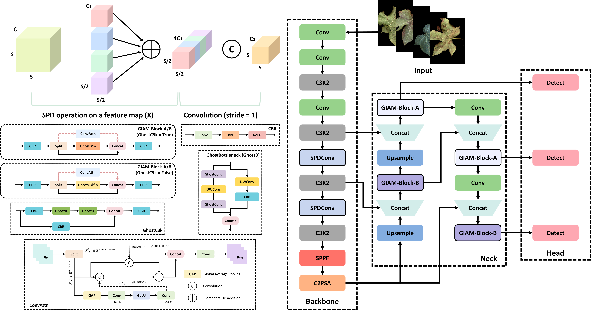
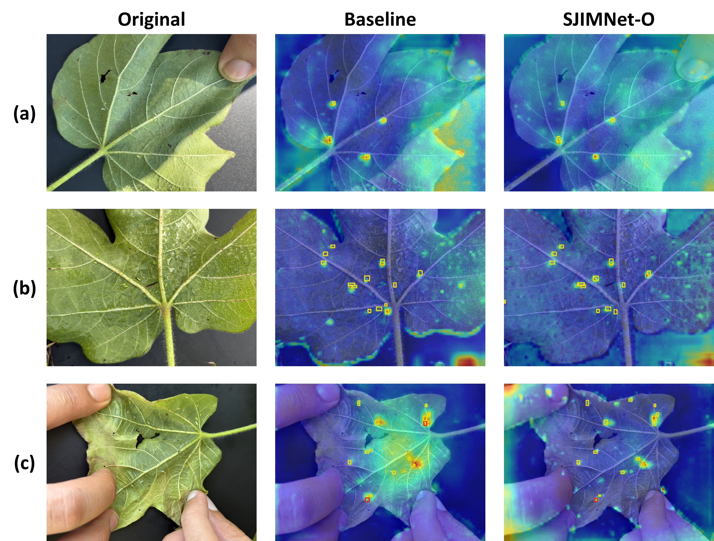
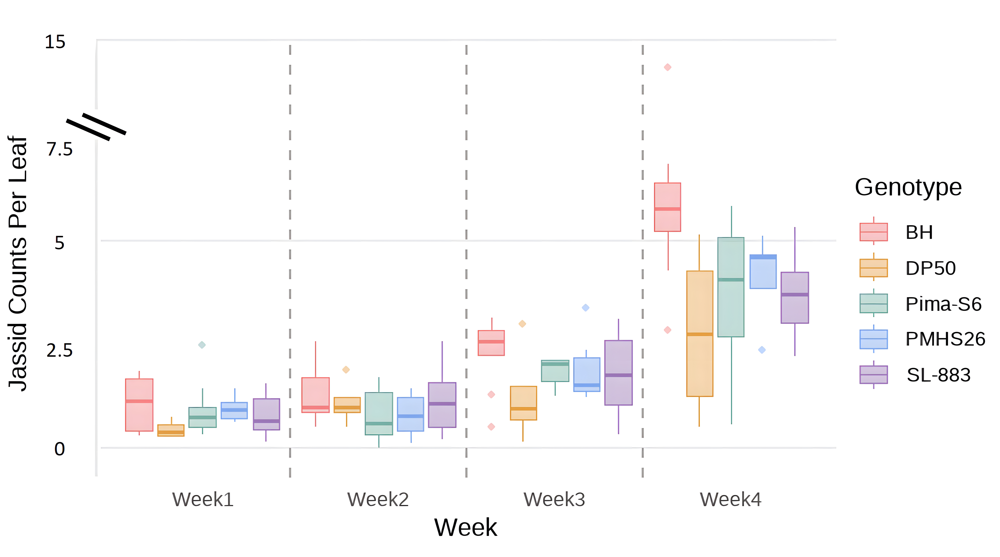

# JassidNet
The repository is for the papaer: [**JassidNet: A Quantization-Aware Lightweight Phenotyping Framework for High-Throughput Cotton Jassid (*Amrasca biguttula*) Detection and Counting Toward Objective Resistance Screening**](https://www.sciencedirect.com/science/article/pii/S0926669026011039), including the code and dataset for reproducing.

This paper is accepted by [***Industrial Crops and Products***](https://www.sciencedirect.com/journal/industrial-crops-and-products).

## Graphical Abstract
<p align="center">
  
  <br>
  <em><strong>Fig.0</strong> Graphical abstract of JassidNet paper.</em>
</p>

## Problem Statement
<p align="center">
  
  <br>
  <em><strong>Fig.1</strong> Illustration of background complexity in field-acquired cotton leaf images and the target-specific focus of the proposed approach.</em>
</p>

## Dataset and Dataset Construction
We propose a ***pseudo-label iteration–based dataset construction strategy*** and introduce the first vision dataset dedicated to cotton jassid recognition, termed the **Cotton Jassid Recognition (CJR) Dataset**.

The dataset will be publicly released on [Kaggle](https://www.kaggle.com/datasets/sweefongwong/cotton-jassid-recognition-cjr-dataset).

<p align="center">
  
  <br>
  <em><strong>Fig.2</strong> Workflow of semi-supervised dataset construction with iteration-based pseudo-labels. <strong>Note:</strong> Flows in the loop are highlighted by pink arrows; pink dashed line indicates that the operation is performed only once; the yellow star marks the start of the entire pipeline.</em>
</p>

<p align="center">
  
  <br>
  <em><strong>Fig.3</strong> Representative images of CJR dataset samples. <strong>Note:</strong> Red circles represents adults (longer length, presence of wings and the characteristic two black spots), and yellow represents nymphs (smaller size when compared to adults and absence of wings).</em>
</p>

## JassidNet Pipeline Overview
<p align="center">
  
  <br>
  <em><strong>Fig.4</strong> Workflow overview of JessidNet. <strong>Note:</strong> Detector-guided/Text-Driven zero-shot segmentation function is highlighted in green dash box, pink dashed arrow indicates optional super-resolution enhancement function, purple dashed arrow indicates the branch of Detector-Guided Zero-Shot Segmentation function, blue dashed arrow indicates the optional branch of Text-Driven Zero-Shot Segmentation function.</em>
</p>

<p align="center">
  
  <br>
  <em><strong>Fig.5</strong> Structural diagram of proposed Smart Jassid Inference and Monitoring Network (SJIMNet) and its key modules. <strong>Note:</strong> modified modules are highlighted by black wireframe.</em>
</p>

## Explainability and Qualitative Results
<p align="center">
  
  <br>
  <em><strong>Fig.6</strong> Feature response visualization of baseline model and the proposed SJIMNet-O under representative jassid densities scenarios: <strong>(a)</strong> low-density; <strong>(b)</strong> medium-density; <strong>(c)</strong> high-density.</em>
</p>

<p align="center">
  
  <br>
  <em><strong>Fig.7</strong> Representative visualization examples of JassidNet on External Test Set.</em>
</p>

## Biological and Breeding Applications
<p align="center">
  
  <br>
  <em><strong>Fig.8</strong> Weekly boxplots of jassid counts per leaf across five cotton genotypes in the first external test set (October 2025).</em>
</p>

## Pretrained Weights
The pretrained weights of **SJIMNet-O (*FP32*)** and **SJIMNet (*INT8*)** are provided in the `weights/` directory:

- `SJIMNet-O.pt`: Optimized model trained on the Cotton Jassid Recognition (CJR) dataset.
- `SJIMNet.pth`: Quantized customized model trained on the CJR dataset.

These weights are intended for inference, visualization (e.g., Grad-CAM), and downstream biological analysis.

## Getting Start
See [**JassidNet Handbook: A Practical Guide for Field Data Collection, Detection, and Phenotyping of Cotton Jassids (*Amrasca biguttula*)**](coming soon, will be released after acceptance).

## Citation
```bibtext
@article{wang2026jassidnet,
  title={JassidNet as a quantization-aware lightweight phenotyping framework for high-throughput cotton jassid (Amrasca biguttula) detection and counting toward objective resistance screening},
  author={Wang, Rui-Feng and Cui, Kangning and Schardong, Iago Beffart and Bauer, Matthew C and Somala, Rama Vamsi and Xu, Mingrui and West, Dalton and Jones, Donald C and Taylor, Sally V and Roberts, Phillip M and Li, Changying and Chee, Peng W.},
  journal={Industrial Crops and Products},
  volume={249},
  pages={123716},
  year={2026},
  publisher={Elsevier}
}

